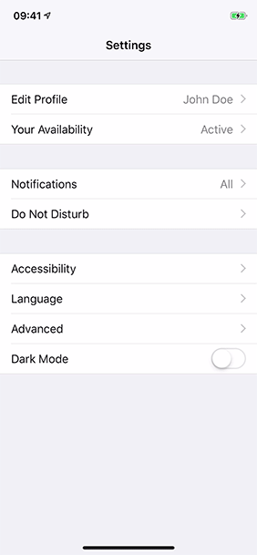

# Dark Mode Toggle 🌌 🌝

After seeing the animation when toggling Dark Theme in [Slack for iOS](https://slack.com/downloads/ios), I thought I'd try my hand at replicating the animation. After that I wondered how I could spice up the animation by doing something different.

## How is this done?

This effect is achieved by leveraging a few techniques:

- Create a snapshot of the current window's view using [`snapshotView(afterScreenUpdates:)`](https://developer.apple.com/documentation/uikit/uiview/1622531-snapshotview)
- Add the `snapshotView` to the window's `rootViewController.view`
- Create a layer mask shape using [`CAShapeLayer`](https://developer.apple.com/documentation/quartzcore/cashapelayer)
- Add the layer mask to the `snapshotView`
- Use [`CABasicAnimation`](https://developer.apple.com/documentation/quartzcore/cabasicanimation) to animate the mask's path
- Finally, remove the `snapshotView` when the animation finishes

## CABasicAnimation notes

By default `CABasicAnimation` returns to the initial state once the animation finishes. You can prevent this behaviour by setting:

```swift
animation.fillMode = .forwards
animation.isRemovedOnCompletion = false
```

Now the animation will stay at it's end state.

Additionally we use a thin closure wrapper around `CAAnimationDelegate`'s `animationDidStop(_:finished:)` method, to create a more modern completion block:

```swift
animation.delegate = AnimationDelegate { finished in
    snapshotView.removeFromSuperview()
    animation.delegate = nil
    completion?(finished)
}
```

## Demo

| Linear | Circular |
|--------|----------|
|  |  |

